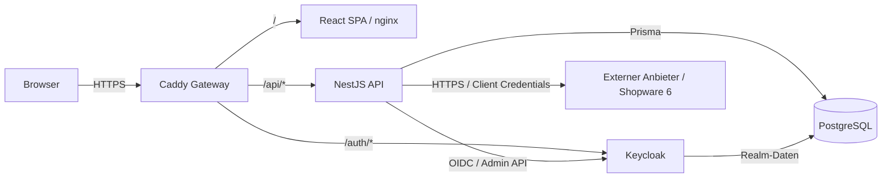

# CMS ERP – Projektdokumentation

**Dokumentationsstand:** 12. August 2026  
**Projektversion:** 0.1.0  
**Status:** lauffähige lokale Entwicklungsgrundlage mit ersten Kernfunktionen

## 1. Projektziel

CMS ERP ist als modular erweiterbares CMS-/ERP-System angelegt. Die aktuelle
Version stellt eine vollständig containerisierte lokale Entwicklungsumgebung sowie
erste fachliche Funktionen bereit. Der Schwerpunkt der bisherigen Arbeiten lag auf:

- einer wartbaren technischen Basis als modularer Monolith,
- zentraler Anmeldung und rollenbasierter Autorisierung,
- einer konsistenten Weboberfläche,
- Benutzer- und Adressverwaltung,
- Artikel- und Lagerverwaltung,
- Verwaltung externer Schnittstellen,
- konfigurierbaren Spezifikationen für Adressen,
- reproduzierbarem Betrieb über Docker Compose und lokalem HTTPS.

Die Bereiche Aufträge, Angebote, Buchhaltung und Produktion sowie einzelne
Unterseiten der Adress- und Lagerverwaltung sind in der Navigation bereits
vorgesehen, aber noch nicht fachlich implementiert.

## 2. Aktueller Funktionsumfang

| Bereich | Stand | Umgesetzte Funktionen |
| --- | --- | --- |
| Infrastruktur | umgesetzt | Docker Compose, Dienstabhängigkeiten, Healthchecks, persistente Volumes |
| HTTPS und Routing | umgesetzt | zentraler Caddy-Gateway, lokale CA, Sicherheitsheader |
| Authentifizierung | umgesetzt | Keycloak, OIDC Authorization Code Flow mit PKCE, Token-Aktualisierung |
| Autorisierung | umgesetzt | zentrale API-Guards und Realm-Rollen `cms-erp-user`/`cms-erp-admin` |
| Benutzerverwaltung | umgesetzt | auflisten, anlegen, bearbeiten, aktivieren/deaktivieren, Administratorrolle, Passwortwechsel |
| Benutzerprofile | umgesetzt | automatische Synchronisierung eines lokalen Profils beim ersten API-Aufruf |
| Adressen | umgesetzt | Übersicht, Suche, Anlage und Bearbeitung mit automatisch vergebener Adressnummer |
| Adressdetails | umgesetzt | Stammdaten, Lieferadressen, Bankdaten, Ansprechpartner, Dokumentverweise und gekaufte Artikel |
| Spezifikationen | umgesetzt | auflisten sowie durch Administratoren anlegen und löschen |
| Artikel | umgesetzt | Übersicht, Suche, Anlage und Bearbeitung einschließlich Preisen, Lagerbeständen, Varianten, Produktbild und Produktionspositionen |
| Artikeleinheiten | umgesetzt | auflisten; durch Administratoren anlegen, umbenennen und löschen |
| Lagerplätze | umgesetzt | Übersicht, Suche sowie Anlage, Bearbeitung und geschützte Löschung |
| Externe Schnittstellen | umgesetzt | Shopware-6-Verbindungen verwalten, Zugangsdaten verschlüsseln und Verbindung testen |
| Datenfreigaben | umgesetzt | Import, Export, Änderung und Löschung je Schnittstelle getrennt freigeben oder sperren |
| Shopware-Kundenimport | umgesetzt | schreibfreie Vorschau und bestätigter, paketweiser Import mit Dublettenprüfung |
| Shopware-Artikelimport | umgesetzt | Vorschau und paketweiser Import einschließlich Bestand, Medien und Variantenbeziehungen |
| Schnittstellen-Zeitpläne | konfigurierbar | Intervalle und Aktivstatus speicherbar; automatische serverseitige Ausführung noch offen |
| Eigene API-Anbindung | umgesetzt | Basis-URL, Authentifizierungsart und verfügbare REST-Ressourcen anzeigen |
| API-Dokumentation | umgesetzt | Swagger/OpenAPI unter `/api/docs` |
| Tests | begonnen | Jest/Vitest konfiguriert; erster API-Sicherheitstest vorhanden, Frontend-Testfälle fehlen |
| Weitere ERP-Module | geplant | Aufträge, Angebote, Buchhaltung und Produktion zeigen Platzhalterseiten |

## 3. Bisher durchgeführte Arbeiten

### 3.1 Technische Grundlage

- Monorepository mit getrennten Anwendungen unter `apps/api` und `apps/web`
- Node.js 22 als Laufzeitbasis
- NestJS-API und React-SPA mit TypeScript
- PostgreSQL als gemeinsame relationale Datenbank
- Prisma als Datenzugriffsschicht mit versionierten Migrationen
- Multi-Stage-Docker-Builds für API und Webanwendung
- eigener API-Docker-Test-Stage und getrennte Produktionsabhängigkeiten
- nginx zur Auslieferung der kompilierten SPA
- Caddy als einziger veröffentlichter Einstiegspunkt auf Port 80/443
- Lazy Loading der größeren Fachseiten zur Aufteilung des Frontend-Bundles

### 3.2 Identität und Sicherheit

- Keycloak-Realm `cms-erp` mit deaktivierter Selbstregistrierung
- öffentlicher Web-Client `cms-erp-web` mit PKCE/S256
- vertraulicher Service-Client `cms-erp-api` für administrative Benutzeroperationen
- Rollen `cms-erp-user` und `cms-erp-admin`
- globaler Bearer-Token-Guard mit RS256-Signatur-, Issuer-, Client- und
  Pflichtrollenprüfung
- separater Rollen-Guard für administrative Endpunkte
- öffentlich erreichbarer Healthcheck als explizite Ausnahme
- Schutz davor, das eigene Administratorkonto zu deaktivieren oder herabzustufen
- UUID-Prüfung für Ressourcen-IDs an den neueren beziehungsweise überarbeiteten
  API-Endpunkten
- Zurückweisung unbekannter Eingabefelder durch die globale DTO-Validierung
- Zeitlimits und verständliche Gateway-Fehler für Keycloak-Admin-Anfragen
- verschlüsselte Speicherung externer Client-Secrets mit AES-256-GCM
- Schutz externer Verbindungstests vor einfachen SSRF-Angriffen: ausschließlich
  HTTPS-Basis-URLs, keine URL-Zugangsdaten, Pfade, Parameter oder Fragmente,
  Ablehnung interner/reservierter IP-Adressen, keine Redirects und zehn Sekunden
  Zeitlimit
- HTTPS, HSTS, Content Security Policy, Permissions Policy, Frame-Schutz,
  `X-Content-Type-Options` und restriktive Referrer-Policy am Gateway

### 3.3 Oberfläche

- responsive React-Oberfläche auf Basis von Material UI
- Hash-Routing ohne zusätzliche Router-Abhängigkeit
- zentrale Navigation und Sitzungsanzeige
- Dark-Theme im terminalähnlichen Erscheinungsbild mit JetBrains Mono
- automatische Token-Erneuerung vor API-Anfragen
- Logout über Keycloak
- sichtbare Fehler- und Erfolgsmeldungen in den Verwaltungsdialogen
- eigenes Keycloak-Login-Theme passend zur Anwendungsoberfläche
- Informationsseite für die eigene REST-API mit kopierbarer Basis-URL
- eigene Vorschau- und Fortschrittsseiten für Kunden- und Artikelimporte
- Einstellungsseite für Schnittstellenintervalle und Zeitplanstatus

### 3.4 Fachmodule

**Benutzerverwaltung**

- Keycloak-Benutzer werden über die NestJS-API verwaltet.
- Servicekonten werden aus der sichtbaren Benutzerliste entfernt.
- Neue Benutzer erhalten immer `cms-erp-user`; `cms-erp-admin` ist optional.
- Benutzername, E-Mail, Aktivstatus und Administratorrecht können geändert werden.
- Passwörter können durch Administratoren neu gesetzt werden.
- Das lokale `UserProfile` wird aus den Claims des angemeldeten Benutzers erzeugt
  beziehungsweise aktualisiert.

**Adressverwaltung**

- Adressen werden serverseitig gesucht und seitenweise mit 10, 50, 100, 200,
  500 oder 1.000 Einträgen geladen. Die Seitenauswahl bleibt unterhalb des
  scrollbaren Tabellenbereichs sichtbar.
- Ein Datensatz kann Kunde, Lieferant oder beides sein.
- Jede Adresse erhält eine eindeutige fortlaufende Nummer; die Oberfläche zeigt sie
  beispielsweise als `ADR-000001` an.
- Firma oder Nachname ist als fachliche Mindestangabe erforderlich.
- Stammdaten, Kontaktwege, Steuerdaten und Notizen werden relational gespeichert.
- Bankdaten, Ansprechpartner, Dokumentverweise und gekaufte Artikel werden aktuell
  als JSON-Strukturen innerhalb der Adresse gespeichert.
- Mehrere Lieferadressen können als JSON-Struktur gepflegt werden. Beim
  Shopware-Import wird eine vom Rechnungskontakt abweichende Standardlieferadresse
  übernommen.
- Adressen können einer Spezifikation zugeordnet werden.

**Spezifikationen**

- Spezifikationen dienen derzeit als frei verwaltbare Quelle beziehungsweise
  Projektzuordnung einer Adresse.
- Namen werden getrimmt und unabhängig von Groß-/Kleinschreibung auf Duplikate
  geprüft.
- Eine verwendete Spezifikation kann aufgrund der restriktiven Datenbankbeziehung
  nicht gelöscht werden; die API übersetzt den Konflikt in eine Fachmeldung.

**Artikelverwaltung**

- Artikel werden nach Artikelnummer sortiert, tabellarisch dargestellt und
  clientseitig durchsucht.
- Unterstützte Arten sind Verkaufsartikel, Produktionsartikel und
  Stücklistenartikel.
- Artikelnummer und Bezeichnung sind verpflichtend; die Artikelnummer ist
  eindeutig.
- Jeder Artikel verweist auf eine zentral verwaltete Einheit und besitzt einen
  Mehrwertsteuersatz.
- Netto-/Bruttogewicht und Abmessungen können mit drei Nachkommastellen gepflegt
  werden. Negative Werte sowie ein Bruttogewicht unter dem Nettogewicht werden
  abgelehnt.
- Mindestens je ein gültiger Einkaufs- und Verkaufsnettopreis mit Gültigkeitsdatum
  ist erforderlich.
- Mindestens ein Lagerplatz mit Bestand und Mindestbestand ist erforderlich. Der
  Gesamtbestand wird serverseitig aus allen Lagerplatzbeständen berechnet.
- Produktions- und Stücklistenartikel benötigen mindestens zwei Positionen.
- Bestehende Artikel können als Varianten eines Elternartikels verknüpft werden;
  Selbstverknüpfungen und unbekannte Varianten-IDs werden abgelehnt.
- Ein Produktbild kann direkt als Bilddatei hinterlegt werden. Zulässig ist genau
  eine Produktabbildung bis 2 MB; weitere Dateien bleiben Metadaten/Verweise.
- Zusätzlich stehen Fremdnummern, weitere Dateiverweise, Notizen und
  Einkaufsinformationen zur Verfügung.

**Artikeleinheiten**

- Einheiten werden zentral in den Einstellungen gepflegt; initial werden `Stück`,
  `Liter` und `Meter` angelegt.
- Namen sind eindeutig und werden ohne Beachtung der Groß-/Kleinschreibung geprüft.
- Verwendete Einheiten können aufgrund der Datenbankbeziehung nicht gelöscht werden.

**Lagerplätze**

- Ein Lagerplatz wird durch Ort, Regal und Platz eindeutig beschrieben.
- Optional können Maximalgewicht sowie Länge, Breite und Tiefe hinterlegt werden.
- Die Übersicht unterstützt Suche, Anlage, Bearbeitung und Löschung.
- Ein in einem Artikelbestand verwendeter Lagerplatz kann nicht gelöscht werden.

**Externe Schnittstellen**

- Administratoren können externe Anbieter anlegen, bearbeiten, aktivieren,
  deaktivieren, testen und löschen.
- Aktuell ist ausschließlich Shopware 6 als Anbieter implementiert.
- Pro Verbindung werden Bezeichnung, Shop-Basis-URL, Access-Key-ID, verschlüsseltes
  Secret, Aktivstatus und das Ergebnis des letzten Verbindungstests gespeichert.
- Das Secret wird nach dem Speichern weder über die API noch in der Oberfläche
  zurückgegeben. Beim Bearbeiten bleibt es erhalten, solange kein neues Secret
  eingegeben wird.
- Der Verbindungstest fordert über `/api/oauth/token` mit dem
  Client-Credentials-Flow ein Shopware-Token an. Er prüft nur die technische
  Authentifizierung und greift nicht auf Shopdaten zu.
- Testergebnis, Zeitpunkt und verständliche Statusmeldung werden persistiert.
- Import, Export, Änderung und Löschung sind getrennte Freigaben. Der sichere
  Standard ist, dass alle vier Aktionen gesperrt sind.

**Shopware-Kundenimport**

- Der Import ist nur bei aktiver Schnittstelle, freigegebenem Import und zuvor
  erfolgreichem Verbindungstest verfügbar.
- Eine schreibfreie Vorschau liest höchstens zehn Kunden und kennzeichnet sie als
  bereit, bereits importiert oder Dublette.
- Nach ausdrücklicher Bestätigung arbeitet der Import in Paketen zu je 25 Kunden.
- Übernommen werden Kunden-/Adressstammdaten, Rechnungsadresse, Kontakt- und
  Steuerdaten, Kommentare sowie eine abweichende Standardlieferadresse.
- Bestehende Datensätze werden anhand der externen Shopware-ID, Kundennummer oder
  E-Mail-Adresse übersprungen. Externe Referenzen sichern die Wiederholbarkeit.
- Importläufe speichern Status, Seite, Gesamtzahl sowie verarbeitete, importierte,
  übersprungene und fehlgeschlagene Datensätze.

**Shopware-Artikelimport**

- Auch der Artikelimport beginnt mit einer schreibfreien Vorschau von höchstens
  zehn Artikeln und erfordert eine Bestätigung.
- Der eigentliche Import verarbeitet Pakete zu je 25 Produkten und protokolliert
  seinen Fortschritt wie der Kundenimport.
- Übernommen werden Artikelnummer, Name, Bestand, Einheit, Mehrwertsteuer,
  Einkaufs-/Verkaufspreis, Gewicht, Abmessungen, Beschreibung, EAN und optional das
  Shopware-Titelbild.
- Nicht vorhandene Einheiten sowie der Lagerplatz
  `Shopware / Import / Bestand` werden bei Bedarf angelegt.
- Titelbilder werden nur vom selben HTTPS-Ursprung geladen, auf unterstützte
  Bildtypen geprüft und auf 2 MB begrenzt.
- Shopware-Eltern-/Kindbeziehungen werden als Artikelvarianten rekonstruiert;
  Variantentypen entstehen aus den sortierten Shopware-Optionen, etwa
  `Farbe: Rot · Größe: M`.
- Bereits referenzierte externe IDs und vorhandene Artikelnummern werden nicht
  erneut importiert.

**Schnittstellen-Zeitpläne**

- Administratoren können je externer Verbindung ein Intervall von einer Minute bis
  10.080 Minuten und einen Aktivstatus speichern.
- Ein Zeitplan lässt sich nur für eine aktive Schnittstelle mit mindestens einer
  Datenfreigabe aktivieren. Beim Deaktivieren der Schnittstelle oder Sperren aller
  Datenaktionen wird er automatisch deaktiviert.
- Die aktuelle Implementierung speichert lediglich diese Einstellungen. Sie enthält
  noch keinen Hintergrunddienst, der Importe oder andere Aktionen automatisch
  ausführt.

**API-Anbindung**

- Eine eigene Einstellungsseite zeigt Basis-URL, JSON als Datenformat, HTTPS und
  OAuth 2.0/OpenID Connect mit Bearer-Token als Zugriffsmethode.
- Aufgeführt werden die Ressourcen Adressen, Artikel, Artikeleinheiten,
  Lagerplätze und Spezifikationen.
- Die Seite stellt Informationen bereit, erzeugt aber keine separaten API-Schlüssel
  oder Servicekonten.

## 4. Systemarchitektur

Das System ist als modularer Monolith umgesetzt. Fachmodule liegen getrennt in API
und Webanwendung, laufen aber jeweils in einem gemeinsamen Prozess. Damit bleibt die
lokale Entwicklung einfach, während Modulgrenzen für eine spätere Erweiterung
erhalten bleiben.



### 4.1 Laufende Dienste

| Dienst | Technologie | Aufgabe | Host-Port |
| --- | --- | --- | --- |
| `gateway` | Caddy 2.10 | TLS-Terminierung, Routing, Sicherheitsheader | 80, 443 |
| `web` | nginx 1.29 | Auslieferung der gebauten React-SPA | keiner |
| `api` | Node.js 22 / NestJS 11 | API, Validierung und Fachlogik | keiner |
| `postgres` | PostgreSQL 18 | Anwendungs- und Keycloak-Daten | keiner |
| `keycloak` | Keycloak 26.7 | Anmeldung, Token, Benutzer und Rollen | keiner |
| `keycloak-config` | Keycloak-Werkzeuge | einmalige/idempotente Nachkonfiguration | keiner |

Nur der Gateway ist vom Host erreichbar. Die übrigen Dienste kommunizieren im
internen Docker-Netzwerk.

### 4.2 Repository-Struktur

```text
CMS_ERP/
├── apps/
│   ├── api/                    NestJS-API, Prisma-Schema und Migrationen
│   └── web/                    React-SPA, Theme und Fachseiten
├── docs/                       Projektdokumentation
├── infrastructure/
│   ├── caddy/                  Gateway-Konfiguration
│   ├── keycloak/               Realm-Import und Nachkonfiguration
│   └── postgres/               Initiales Keycloak-Datenbankschema
├── UI-Vorlage/                 gestalterische Ausgangsreferenz
├── compose.yaml                lokale Gesamtumgebung
├── ARCHITECTURE.md             verbindliche Architekturgrundsätze
└── README.md                   Schnellstart
```

Neue Fachmodule sollen dem Vertrag in `ARCHITECTURE.md` folgen: getrennte
Modulordner, eigene Tabellen und Migrationen, explizite Berechtigungen sowie Unit-,
Integrations- und Browser-Tests.

## 5. Datenmodell

### 5.1 `UserProfile`

Lokale Projektion eines Keycloak-Benutzers. Das eigentliche Kennwort und die
Autorisierungsdaten verbleiben ausschließlich in Keycloak.

| Feld | Bedeutung |
| --- | --- |
| `id` | interne UUID |
| `identityId` | eindeutige Keycloak-Subject-ID (`sub`) |
| `username`, `email`, `displayName` | aus dem Access Token synchronisierte Angaben |
| `createdAt`, `updatedAt` | technische Zeitstempel |

### 5.2 `Address`

| Feldgruppe | Inhalt |
| --- | --- |
| Identität | UUID und eindeutige fortlaufende `addressNumber` |
| Zuordnung | optionale Kunden-/Lieferantennummer, Art, Spezifikation |
| Person/Firma | Firma, Anrede, Vorname, Nachname |
| Anschrift | Straße, Hausnummer, PLZ, Ort, Land |
| Kommunikation | E-Mail, Telefon, Mobil, Webseite |
| Weitere Daten | Steuernummer und Notizen |
| JSON-Daten | Bankdaten, Lieferadressen, Ansprechpartner, Dokumentverweise, gekaufte Artikel |
| Technik | Erstellungs- und Änderungszeitpunkt |

Indizes bestehen auf Firma, Nachname, Kunden-/Lieferantennummer und
Spezifikations-ID.

### 5.3 `Specification`

Eine Spezifikation besteht aus UUID, eindeutigem Namen und Erstellungszeitpunkt. Die
Beziehung zu `Address` ist optional; beim Löschen gilt `RESTRICT`.

### 5.4 `Article`

| Feldgruppe | Inhalt |
| --- | --- |
| Identität | UUID, eindeutige Artikelnummer und Bezeichnung |
| Klassifikation | Verkaufs-, Produktions- oder Stücklistenartikel |
| Einheit und Steuer | Relation zu `ArticleUnit`, Mehrwertsteuersatz |
| Bestand | berechneter Gesamtbestand und lagerplatzbezogene Bestände als JSON |
| Maße | Netto-/Bruttogewicht in kg sowie Länge, Breite und Höhe in cm |
| Preise | Einkaufs- und Verkaufspreisverläufe als JSON |
| Fertigung | Positionen beziehungsweise Stücklistenbestandteile als JSON |
| Varianten | relationale Selbstbeziehung über `ArticleVariantLink` einschließlich optionalem Variantentyp |
| Weitere Daten | Fremdnummern, Produktbild/Dateiverweise, Einkaufskonfiguration und Notizen |
| Technik | Erstellungs- und Änderungszeitpunkt |

Indizes bestehen auf Bezeichnung, Artikelart und Einheit. Die Artikelnummer ist
eindeutig. Der Gesamtbestand wird nicht unabhängig eingegeben, sondern beim
Speichern aus `stockEntries` summiert.

### 5.5 `ArticleVariantLink`

Verknüpft einen Elternartikel mit einem eigenständigen Variantenartikel. Der
zusammengesetzte Primärschlüssel verhindert doppelte Links; ein Datenbank-Check
verhindert Selbstverknüpfungen. `variantType` enthält eine optionale fachliche
Beschreibung der Ausprägung. Beim Löschen eines beteiligten Artikels werden die
Links kaskadierend entfernt.

### 5.6 `ArticleUnit`

Zentraler, eindeutig benannter Einheitenstamm mit UUID und Zeitstempeln. Artikel
referenzieren eine Einheit per Fremdschlüssel; beim Löschen gilt `RESTRICT`.

### 5.7 `WarehouseLocation`

Lagerplätze besitzen die Pflichtfelder Ort, Regal und Platz sowie optionale
Kapazitätsangaben für Maximalgewicht und Abmessungen. Die Kombination aus Ort,
Regal und Platz ist eindeutig. Artikel referenzieren Lagerplätze aktuell innerhalb
der JSON-Struktur `stockEntries` über deren UUID.

### 5.8 `ExternalIntegration`

| Feldgruppe | Inhalt |
| --- | --- |
| Identität | UUID und eindeutige Bezeichnung |
| Anbieter | derzeit `SHOPWARE_6`, Basis-URL und Client-ID |
| Zugang | mit AES-256-GCM verschlüsseltes Client-Secret |
| Betrieb | Aktivstatus, Testergebnis sowie konfigurierter Zeitplan und Intervall |
| Freigaben | Import, Export, Änderung und Löschung; jeweils standardmäßig `false` |
| Technik | Erstellungs- und Änderungszeitpunkt |

Indizes bestehen auf Anbieter und Aktivstatus. Öffentliche API-Antworten schließen
das verschlüsselte Secret konsequent aus und liefern stattdessen nur
`credentialConfigured: true`.

### 5.9 `ExternalEntityReference`

Ordnet eine externe Shopware-ID eindeutig einer Integration und einem lokalen
Kunden- oder Artikeldatensatz zu. Für Artikel werden zusätzlich externe Eltern-ID
und Variantentyp gespeichert. Die eindeutige Kombination aus Integration,
Entitätstyp und externer ID verhindert Mehrfachimporte. Beim Löschen der Integration
oder des lokalen Datensatzes werden die Referenzen kaskadierend entfernt.

### 5.10 `CustomerImportJob` und `ArticleImportJob`

Persistente Fortschrittsmodelle für paketweise Importe. Sie speichern Status,
aktuelle Seite, Paketgröße, Gesamtzahl, Zähler für verarbeitet/importiert/
übersprungen/fehlgeschlagen, letzte Fehlermeldung und Abschlusszeitpunkt. Pro
Integration wird ein Index auf Integration und Status verwendet.

## 6. API-Übersicht

Alle Endpunkte liegen unter `/api`. Bis auf den Healthcheck wird ein gültiges
Keycloak-Bearer-Token benötigt.

| Methode | Pfad | Berechtigung | Zweck |
| --- | --- | --- | --- |
| `GET` | `/health` | öffentlich | API- und Datenbankstatus |
| `GET` | `/users/me` | angemeldet | eigenes lokales Profil laden/synchronisieren |
| `GET` | `/users` | `cms-erp-admin` | Benutzer auflisten |
| `POST` | `/users` | `cms-erp-admin` | Benutzer anlegen |
| `PATCH` | `/users/:id` | `cms-erp-admin` | Benutzer und Rollen ändern |
| `PUT` | `/users/:id/password` | `cms-erp-admin` | Passwort neu setzen |
| `GET` | `/addresses?page=1&pageSize=100&search=…` | angemeldet | Adressen mit Spezifikation suchen und seitenweise auflisten |
| `POST` | `/addresses` | angemeldet | Adresse anlegen |
| `PATCH` | `/addresses/:id` | angemeldet | Adresse bearbeiten |
| `GET` | `/specifications` | angemeldet | Spezifikationen auflisten |
| `POST` | `/specifications` | `cms-erp-admin` | Spezifikation anlegen |
| `DELETE` | `/specifications/:id` | `cms-erp-admin` | unbenutzte Spezifikation löschen |
| `GET` | `/articles` | angemeldet | Artikel mit Einheit auflisten |
| `POST` | `/articles` | angemeldet | Artikel anlegen und Bestand berechnen |
| `PATCH` | `/articles/:id` | angemeldet | Artikel bearbeiten und Bestand neu berechnen |
| `GET` | `/article-units` | angemeldet | Artikeleinheiten auflisten |
| `POST` | `/article-units` | `cms-erp-admin` | Artikeleinheit anlegen |
| `PATCH` | `/article-units/:id` | `cms-erp-admin` | Artikeleinheit umbenennen |
| `DELETE` | `/article-units/:id` | `cms-erp-admin` | unbenutzte Artikeleinheit löschen |
| `GET` | `/warehouse-locations` | angemeldet | Lagerplätze auflisten |
| `POST` | `/warehouse-locations` | `cms-erp-admin` | Lagerplatz anlegen |
| `PATCH` | `/warehouse-locations/:id` | `cms-erp-admin` | Lagerplatz bearbeiten |
| `DELETE` | `/warehouse-locations/:id` | `cms-erp-admin` | unbenutzten Lagerplatz löschen |
| `GET` | `/external-integrations` | `cms-erp-admin` | externe Verbindungen auflisten |
| `GET` | `/external-integrations/:id` | `cms-erp-admin` | Verbindung ohne Secret laden |
| `POST` | `/external-integrations` | `cms-erp-admin` | Shopware-Verbindung anlegen |
| `PATCH` | `/external-integrations/:id` | `cms-erp-admin` | Verbindung bearbeiten/aktivieren |
| `PATCH` | `/external-integrations/:id/data-permissions` | `cms-erp-admin` | Datenaktionen freigeben oder sperren |
| `PATCH` | `/external-integrations/:id/cron-settings` | `cms-erp-admin` | Zeitplan und Intervall konfigurieren |
| `POST` | `/external-integrations/:id/test` | `cms-erp-admin` | Shopware-Authentifizierung testen |
| `POST` | `/external-integrations/:id/customer-import/preview` | `cms-erp-admin` | schreibfreie Kundenvorschau laden |
| `GET` | `/external-integrations/:id/customer-import/latest` | `cms-erp-admin` | letzten Kundenimportlauf laden |
| `POST` | `/external-integrations/:id/customer-import/start` | `cms-erp-admin` | bestätigten Kundenimport starten |
| `POST` | `/external-integrations/:id/customer-import/:jobId/next` | `cms-erp-admin` | nächsten Kundenblock verarbeiten |
| `POST` | `/external-integrations/:id/article-import/preview` | `cms-erp-admin` | schreibfreie Artikelvorschau laden |
| `GET` | `/external-integrations/:id/article-import/latest` | `cms-erp-admin` | letzten Artikelimportlauf laden |
| `POST` | `/external-integrations/:id/article-import/start` | `cms-erp-admin` | bestätigten Artikelimport starten |
| `POST` | `/external-integrations/:id/article-import/:jobId/next` | `cms-erp-admin` | nächsten Artikelblock verarbeiten |
| `DELETE` | `/external-integrations/:id` | `cms-erp-admin` | Verbindung löschen |

Die interaktive Swagger-Dokumentation ist unter
`https://cms-erp.localhost/api/docs` erreichbar. Eingaben werden global durch
`class-validator` geprüft; unbekannte Felder weist die API zurück. Ressourcen-IDs
werden an den Benutzer-, Spezifikations-, Artikel-, Einheiten-, Lagerplatz- und
Schnittstellen-Endpunkten als UUID validiert.

## 7. Rollen- und Berechtigungskonzept

| Rolle | Zugriff |
| --- | --- |
| `cms-erp-user` | Anmeldung und reguläre geschützte Funktionen, einschließlich Adress- und Artikelpflege sowie lesendem Lagerplatzzugriff |
| `cms-erp-admin` | zusätzlich Benutzerverwaltung, Pflege von Spezifikationen und Artikeleinheiten, schreibender Lagerplatzzugriff sowie vollständige Schnittstellenverwaltung |

Die Oberfläche blendet beziehungsweise sperrt administrative Funktionen. Die
maßgebliche Durchsetzung erfolgt jedoch serverseitig durch den Rollen-Guard.

## 8. Lokale Inbetriebnahme

### 8.1 Voraussetzungen

- Docker mit Compose-Unterstützung
- freie Host-Ports 80 und 443
- lokaler Browser; für warnungsfreies HTTPS optional Zugriff auf den macOS-Schlüsselbund

### 8.2 Konfiguration

Die Datei `.env.example` enthält alle benötigten Variablen:

```dotenv
POSTGRES_DB=cms_erp
POSTGRES_USER=cms_erp
POSTGRES_PASSWORD=local-db-password
KEYCLOAK_ADMIN=admin
KEYCLOAK_ADMIN_PASSWORD=local-admin-password
KEYCLOAK_APP_ADMIN_PASSWORD=admin
KEYCLOAK_API_CLIENT_SECRET=local-api-client-secret
```

Für die lokale Umgebung wird daraus eine nicht einzucheckende `.env` angelegt. Die
Beispielwerte und das Anwendungskonto `admin`/`admin` sind ausschließlich für die
Entwicklung vorgesehen.

Die Compose-Konfiguration übergibt `KEYCLOAK_API_CLIENT_SECRET` derzeit zusätzlich
als `INTEGRATION_ENCRYPTION_KEY` an die API. Daraus leitet die Anwendung per SHA-256
den AES-256-GCM-Schlüssel für externe Client-Secrets ab. Ein Wechsel dieses Wertes
macht bereits gespeicherte Secrets ohne vorherige Rotation unlesbar. Für einen
produktiven Betrieb sollte deshalb ein eigener, langlebiger Verschlüsselungsschlüssel
mit geregelter Rotation und Sicherung verwendet werden.

### 8.3 Start und Erreichbarkeit

```bash
docker compose up --build -d
docker compose ps
```

| Ziel | URL |
| --- | --- |
| Anwendung | `https://cms-erp.localhost` |
| Swagger/API | `https://cms-erp.localhost/api/docs` |
| Healthcheck | `https://cms-erp.localhost/api/health` |
| Keycloak-Administration | `https://cms-erp.localhost/auth/admin/` |

Beim Start führt die API ausstehende Prisma-Migrationen automatisch aus. Keycloak
importiert den Realm und bindet das projektspezifische Login-Theme ein.
`keycloak-config` gleicht Benutzerprofil, Login-Theme, Service-Client,
Servicekonto-Rechte und das lokale Administratorkonto ab. Das Kennwort des
Anwendungskontos stammt aus `KEYCLOAK_APP_ADMIN_PASSWORD`; die Compose-Konfiguration
bricht ab, wenn diese Variable fehlt.

### 8.4 Lokales Zertifikat unter macOS

```bash
docker compose cp gateway:/data/caddy/pki/authorities/local/root.crt ./cms-erp-local-ca.crt
security add-trusted-cert -r trustRoot \
  -k "$HOME/Library/Keychains/login.keychain-db" ./cms-erp-local-ca.crt
```

Ohne Installation der lokalen CA bleibt die Anwendung erreichbar, der Browser zeigt
jedoch eine Zertifikatswarnung.

### 8.5 Betrieb und Fehleranalyse

```bash
docker compose ps
docker compose logs -f
docker compose logs -f api keycloak gateway
docker compose down
```

`docker compose down` erhält die Daten in den benannten Volumes. Der Zusatz `-v`
löscht Datenbank, Keycloak- und Caddy-Daten dauerhaft und darf nur bewusst verwendet
werden.

## 9. Entwicklung und Qualitätssicherung

Aus dem Repository-Wurzelverzeichnis sind folgende Skripte definiert:

```bash
npm run build
npm test
```

Sie rufen die Build- beziehungsweise Testskripte beider Workspaces auf. Zusätzlich
stehen in den Anwendungen unter anderem `start:dev`, `prisma:generate`,
`prisma:migrate` und `dev` bereit.

Das API-Dockerfile besitzt außerdem einen separaten `test`-Stage. Der Runtime-Stage
enthält nur Produktionsabhängigkeiten; Prisma ist deshalb als Laufzeitabhängigkeit
eingetragen, damit Migrationen beim Containerstart ausgeführt werden können.

### Verifizierter Stand am 12. August 2026

- Der Web-TypeScript-Build und der Vite-Produktionsbuild laufen erfolgreich durch.
- Vitest läuft erfolgreich, meldet aber ausdrücklich, dass keine Testdateien
  vorhanden sind.
- Die Fachseiten werden per Lazy Loading in eigene JavaScript-Chunks aufgeteilt.
  Der größte initiale Chunk liegt nach dem aktuellen Produktionsbuild bei rund
  376 kB; Vites Warnschwelle von 500 kB wird nicht überschritten.
- Für den API-Schnittstellenservice existiert ein erster Jest-Test, der unsichere
  URLs wie HTTP, URL-Zugangsdaten, zusätzliche Pfade, Loopback- und
  Cloud-Metadatenadressen ablehnt.
- Der API-Build wurde in der Dokumentationsumgebung nicht erneut ausgeführt, weil
  dort keine API-Abhängigkeiten installiert waren. Entsprechend wurde der neue
  Jest-Test in diesem Dokumentationsschritt nicht lokal ausgeführt.
- `docker compose config --quiet` bestätigt eine syntaktisch gültige und vollständig
  auflösbare Compose-Konfiguration.
- Ein vollständiger Docker-Integrationstest wurde in diesem Arbeitsschritt nicht
  durchgeführt.

## 10. Bekannte Grenzen und offene Punkte

- Die automatisierte Testabdeckung ist weiterhin sehr gering: Es existiert ein
  erster API-Unit-Test, aber noch keine Fachmodul-, Integrations- oder Browsertests
  und keine Frontend-Testfälle.
- Die Navigationspunkte für Aufträge, Angebote, Buchhaltung und Produktion sind
  reine Platzhalter. Im Lager sind Artikel und Lagerplätze umgesetzt; Bestände und
  Bewegungen besitzen noch eigene Platzhalterseiten.
- Kunden-, Lieferanten- und Ansprechpartner-Unterseiten sind vorbereitet, besitzen
  aber noch keine eigene gefilterte Fachansicht.
- Adressen können derzeit nicht gelöscht werden; die API bietet Auflisten, Anlegen
  und Bearbeiten.
- Artikel können derzeit nicht gelöscht werden; die API bietet Auflisten, Anlegen
  und Bearbeiten.
- Alle angemeldeten Benutzer dürfen derzeit Adressen und Artikel anlegen und
  bearbeiten. Lagerplätze können sie lesen; Änderungen sowie die gesamte
  Schnittstellenverwaltung sind Administratoren vorbehalten. Falls feinere
  Zuständigkeiten erforderlich sind, müssen zusätzliche Rollen eingeführt werden.
- Bankdaten, Lieferadressen, Ansprechpartner, Dokumentverweise und gekaufte Artikel
  sind flexible JSON-Felder. Eigene Tabellen werden erforderlich, sobald diese
  Daten separat gesucht, validiert, versioniert oder referenziert werden sollen.
- Adressdokumente und zusätzliche Artikeldateien sind aktuell nur Verweise oder
  Metadaten. Lediglich eine Produktabbildung je Artikel kann als eingebettete
  Data-URL gespeichert beziehungsweise aus Shopware übernommen werden; eine
  allgemeine Datei- und Medienablage fehlt.
- Lagerplatzreferenzen eines Artikels werden in JSON gespeichert und nicht durch
  Datenbank-Fremdschlüssel abgesichert. Vor dem Speichern prüft die API zwar die
  Existenz; referenzielle Integrität und Abfragen bleiben jedoch aufwendiger als bei
  einer relationalen Bestandsentität.
- Die Shopware-Anbindung importiert Kunden und Artikel ausschließlich neu. Bereits
  importierte beziehungsweise als Dublette erkannte Datensätze werden übersprungen;
  ein Update-/Merge-Verfahren für spätere Shopware-Änderungen fehlt.
- Export, Aktualisierung und Löschung über Shopware sind noch nicht implementiert.
  Die entsprechenden Freigaben werden bislang nur gespeichert.
- Zeitplan und Intervall können konfiguriert werden, es existiert aber noch kein
  serverseitiger Scheduler. Importe laufen nur, solange die Verwaltungsseite die
  einzelnen Pakete aktiv anfordert. Ein Lauf im Status `RUNNING` wird beim erneuten
  Start fortgesetzt; für dauerhaft im Status `PROCESSING` verbliebene Läufe fehlt
  derzeit eine automatische Wiederherstellung.
- Die Datenfreigaben sind grob nach Aktion getrennt, aber noch nicht nach
  Ressourcen, Feldern oder Datenrichtung je Entität differenziert.
- Importfehler werden nur als Summenzähler und letzte Laufmeldung gespeichert; eine
  revisionsfähige Fehlerliste je Datensatz fehlt.
- Produktbilder werden als Data-URL im JSON-Feld des Artikels gespeichert. Das ist
  für kleine lokale Datenmengen praktikabel, ersetzt aber keine skalierbare
  Medienablage.
- Der Verschlüsselungsschlüssel für externe Secrets ist in der lokalen
  Compose-Konfiguration an das Keycloak-API-Client-Secret gekoppelt. Es gibt noch
  keinen Rotations- oder Wiederherstellungsprozess.
- Passwortregeln beschränken sich in den API-DTOs auf einen nichtleeren Wert. Eine
  produktionsgerechte Keycloak-Passwortrichtlinie ist noch festzulegen.
- Konfiguration und mitgelieferte Konten sind ausdrücklich nicht für den
  Produktivbetrieb gehärtet.
- Observability, Backups, Wiederherstellung, CI/CD und ein Produktions-Deployment
  sind noch nicht umgesetzt.

## 11. Empfohlene nächste Schritte

1. Automatisierte Tests für Auth-Guards, Schnittstellenverschlüsselung,
   Verbindungstest, Fachservices und zentrale UI-Abläufe ergänzen.
2. Rollen für lesenden und schreibenden Adress-, Artikel- und Lagerzugriff fachlich
   festlegen.
3. Artikelmodul um serverseitige Suche, Paginierung und Filter sowie Adress- und
   Artikelmodule um Detailabruf und Löschung/Archivierung erweitern.
4. Lagerbestände, Preisverläufe, Stücklisten und weitere fachlich relevante
   JSON-Strukturen nach Klärung in eigenständige Entitäten überführen.
5. Shopware-Import um Aktualisierungs-/Merge-Strategie, detaillierte
   Datensatzprotokolle und kontrollierte Wiederholung fehlgeschlagener Datensätze
   erweitern; anschließend Export und Löschung fachlich konzipieren.
6. Bestandsbewegungen als revisionsfähige Buchungen umsetzen, statt Bestände nur
   als aktuellen Zahlenwert zu speichern.
7. Einen echten Hintergrund-Worker für aktivierte Zeitpläne implementieren und mit
   Sperren gegen parallele Läufe, Laufhistorie und Monitoring absichern.
8. Vor einem produktiven Einsatz eigenständige Schlüsselverwaltung und Rotation,
   Secrets, Passwortregeln, Backups, Monitoring und extern vertrauenswürdiges TLS
   konzipieren.
9. CI-Pipeline mit Build, Tests, Migrationstest und Containerprüfung einrichten.

## 12. Wichtige Projektdateien

| Datei/Verzeichnis | Zweck |
| --- | --- |
| `README.md` | kompakter Schnellstart |
| `ARCHITECTURE.md` | Architekturentscheidung und Modulvertrag |
| `compose.yaml` | Orchestrierung der lokalen Dienste |
| `.env.example` | Vorlage der lokalen Konfiguration |
| `apps/api/prisma/schema.prisma` | aktuelles relationales Datenmodell |
| `apps/api/prisma/migrations/` | versionierte Datenbankänderungen |
| `apps/api/src/core/auth/` | Authentifizierungs- und Rollenprüfung |
| `apps/api/src/modules/` | API-Fachmodule |
| `apps/api/src/modules/external-integrations/` | Verwaltung, Verschlüsselung und Test externer Verbindungen |
| `apps/web/src/modules/` | Oberflächen der Fachmodule |
| `infrastructure/keycloak/` | Realm, Benutzerprofil und Nachkonfiguration |
| `infrastructure/keycloak/themes/` | projektspezifisches Keycloak-Login-Theme |
| `infrastructure/caddy/Caddyfile` | HTTPS und Reverse-Proxy-Routing |
